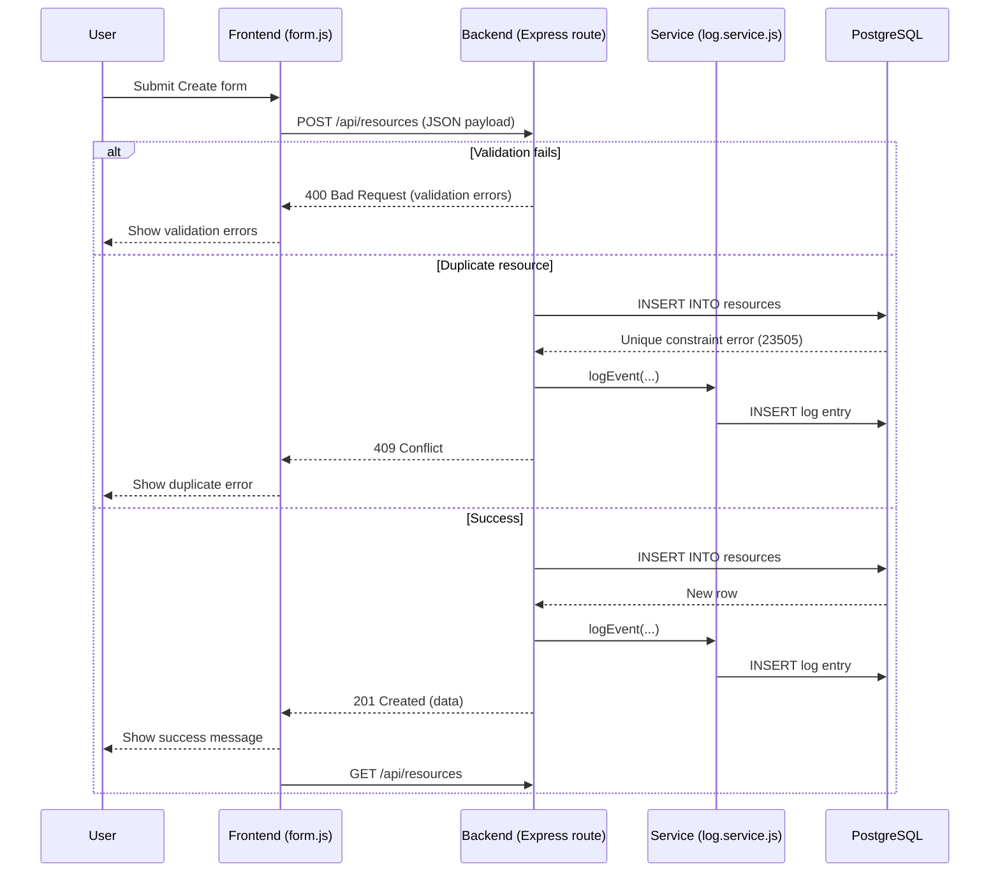
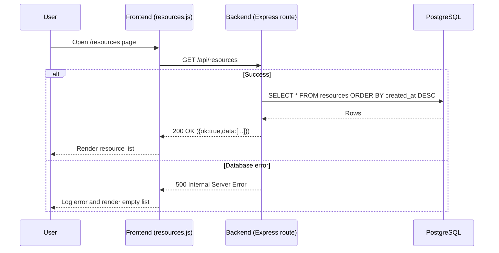
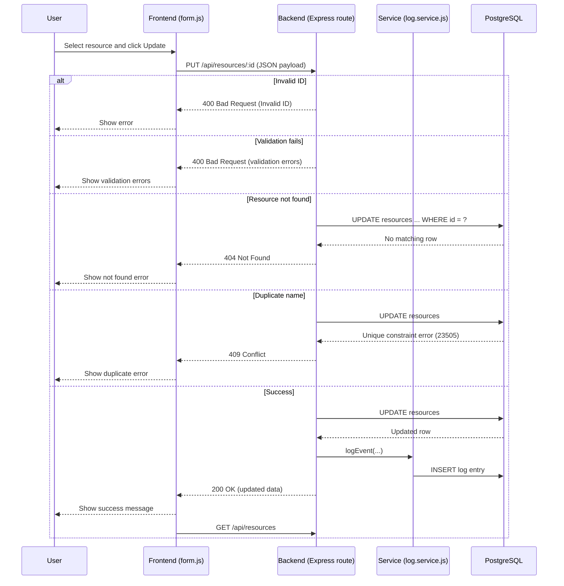
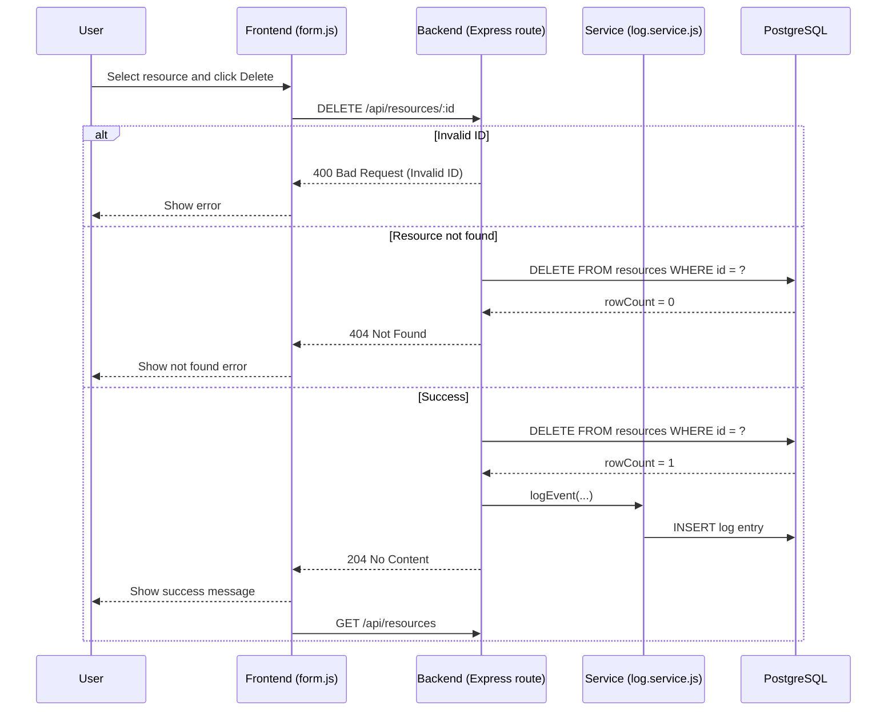

# G1 – CRUD Data Flow (Booking System Phase6)

## CREATE (C)

```mermaid
sequenceDiagram
    participant User
    participant Frontend as Frontend (form.js)
    participant Backend as Backend (Express route)
    participant Service as Service (log.service.js)
    participant DB as PostgreSQL

    User->>Frontend: Submit Create form
    Frontend->>Backend: POST /api/resources (JSON payload)

    alt Validation fails
        Backend-->>Frontend: 400 Bad Request (validation errors)
        Frontend-->>User: Show validation errors
    else Duplicate resource
        Backend->>DB: INSERT INTO resources
        DB-->>Backend: Unique constraint error (23505)
        Backend->>Service: logEvent(...)
        Service->>DB: INSERT log entry
        Backend-->>Frontend: 409 Conflict
        Frontend-->>User: Show duplicate error
    else Success
        Backend->>DB: INSERT INTO resources
        DB-->>Backend: New row
        Backend->>Service: logEvent(...)
        Service->>DB: INSERT log entry
        Backend-->>Frontend: 201 Created (data)
        Frontend-->>User: Show success message
        Frontend->>Backend: GET /api/resources
    end
```

## READ (R)

```mermaid
sequenceDiagram
    participant User
    participant Frontend as Frontend (resources.js)
    participant Backend as Backend (Express route)
    participant DB as PostgreSQL

    User->>Frontend: Open /resources page
    Frontend->>Backend: GET /api/resources

    alt Success
        Backend->>DB: SELECT * FROM resources ORDER BY created_at DESC
        DB-->>Backend: Rows
        Backend-->>Frontend: 200 OK ({ok:true,data:[...]})
        Frontend-->>User: Render resource list
    else Database error
        Backend-->>Frontend: 500 Internal Server Error
        Frontend-->>User: Log error and render empty list
    end
```

## UPDATE (U)

```mermaid
sequenceDiagram
    participant User
    participant Frontend as Frontend (form.js)
    participant Backend as Backend (Express route)
    participant Service as Service (log.service.js)
    participant DB as PostgreSQL

    User->>Frontend: Select resource and click Update
    Frontend->>Backend: PUT /api/resources/:id (JSON payload)

    alt Invalid ID
        Backend-->>Frontend: 400 Bad Request (Invalid ID)
        Frontend-->>User: Show error
    else Validation fails
        Backend-->>Frontend: 400 Bad Request (validation errors)
        Frontend-->>User: Show validation errors
    else Resource not found
        Backend->>DB: UPDATE resources ... WHERE id = ?
        DB-->>Backend: No matching row
        Backend-->>Frontend: 404 Not Found
        Frontend-->>User: Show not found error
    else Duplicate name
        Backend->>DB: UPDATE resources
        DB-->>Backend: Unique constraint error (23505)
        Backend-->>Frontend: 409 Conflict
        Frontend-->>User: Show duplicate error
    else Success
        Backend->>DB: UPDATE resources
        DB-->>Backend: Updated row
        Backend->>Service: logEvent(...)
        Service->>DB: INSERT log entry
        Backend-->>Frontend: 200 OK (updated data)
        Frontend-->>User: Show success message
        Frontend->>Backend: GET /api/resources
    end
```

## DELETE (D)

```mermaid
sequenceDiagram
    participant User
    participant Frontend as Frontend (form.js)
    participant Backend as Backend (Express route)
    participant Service as Service (log.service.js)
    participant DB as PostgreSQL

    User->>Frontend: Select resource and click Delete
    Frontend->>Backend: DELETE /api/resources/:id

    alt Invalid ID
        Backend-->>Frontend: 400 Bad Request (Invalid ID)
        Frontend-->>User: Show error
    else Resource not found
        Backend->>DB: DELETE FROM resources WHERE id = ?
        DB-->>Backend: rowCount = 0
        Backend-->>Frontend: 404 Not Found
        Frontend-->>User: Show not found error
    else Success
        Backend->>DB: DELETE FROM resources WHERE id = ?
        DB-->>Backend: rowCount = 1
        Backend->>Service: logEvent(...)
        Service->>DB: INSERT log entry
        Backend-->>Frontend: 204 No Content
        Frontend-->>User: Show success message
        Frontend->>Backend: GET /api/resources
    end
```